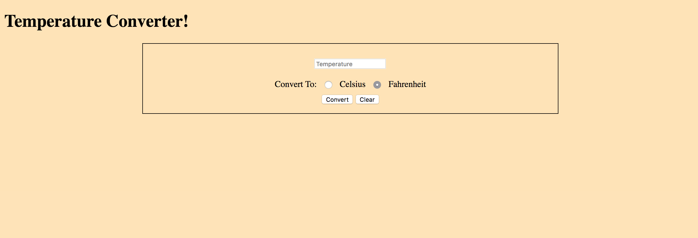
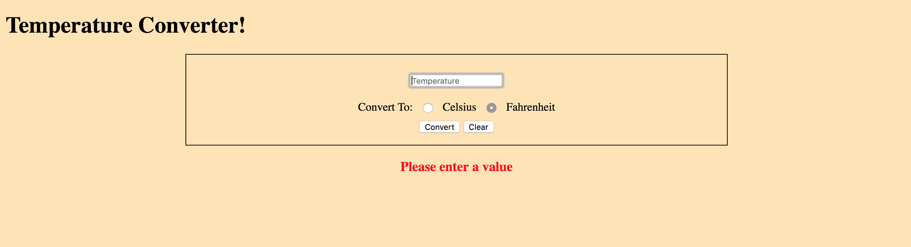
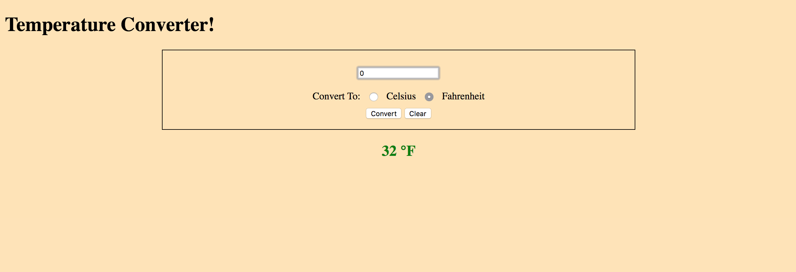
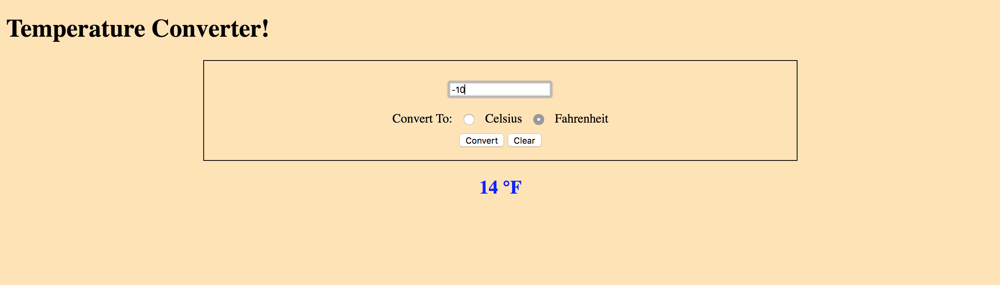
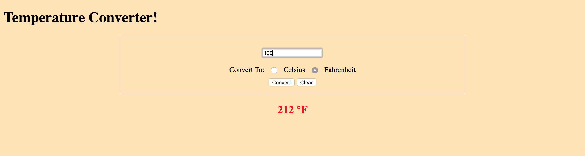

# Temperature Converter Project

### Description
##### A fun little program that takes in an input of a temperature (F or C) and then converts it into either F or C. The result changes color to whether it is very cold, regular, or very hot. If the field is left blank then an error will pop up asking to insert a value

Here is the base website:

When it throws an error for an empty field: 

When the temp is in the mid range: 

When the temp is in the cold range:

When the temp is in the hot range:
